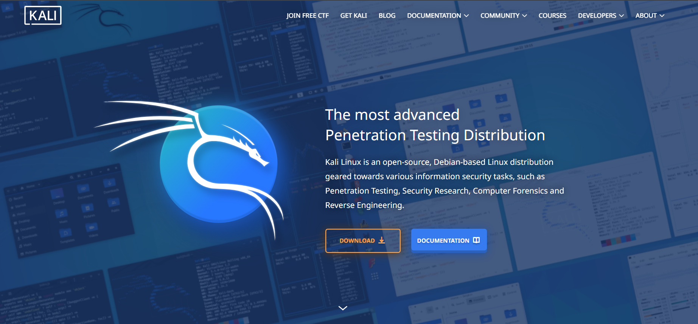
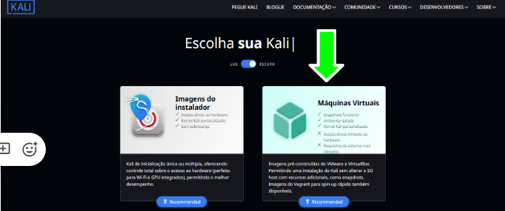
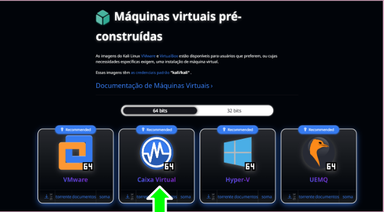
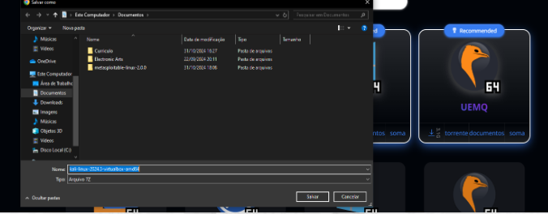
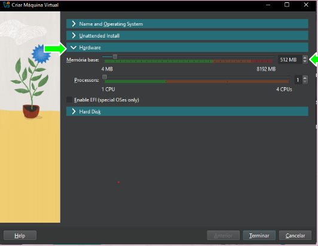
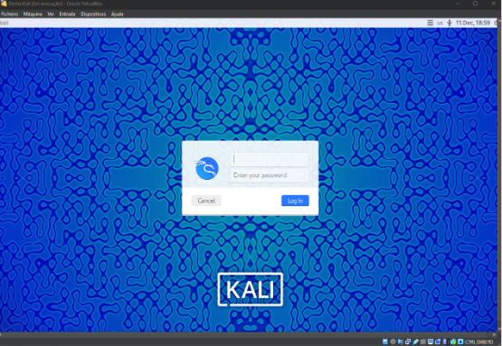

# Kali Linux VirtualBox Installation Guide

## 1. Introduction

This guide documents the installation of Kali Linux as a virtual machine using Oracle VirtualBox.

The objective was to create a controlled environment for cybersecurity learning and practical experimentation.

---

## 2. Downloading Kali Linux

The installation started by accessing the official Kali Linux website and navigating to the download section.

Kali Linux provides different installation options depending on the intended environment. For this laboratory, the **Virtual Machines** option was selected.

---

## 3. Selecting the VirtualBox Image

The Virtual Machines section provides pre-built images for different virtualization platforms.

For this laboratory, the **VirtualBox** image was selected.

---

## 4. Preparing the Virtual Machine

After downloading the Kali Linux virtual machine package, the required files were extracted using **7-Zip**.

The extracted virtual disk was then prepared to be used with VirtualBox.

---

## 5. VirtualBox Configuration

A new virtual machine was configured in VirtualBox using Linux as the operating system and a 64-bit architecture.

The available hardware resources were configured according to the host computer's capacity.

---

## 6. Starting Kali Linux

After completing the virtual machine configuration, Kali Linux was started through VirtualBox.

The virtual machine successfully booted into the Kali Linux environment.

---

## 7. Result

The installation was successfully completed and Kali Linux was running inside a VirtualBox virtual machine.

This environment provides a controlled laboratory for future cybersecurity exercises involving Linux, networking, vulnerability assessment and security testing.

## 8. Key Takeaways

This practical exercise provided experience with:

* Virtual machine deployment
* Kali Linux installation
* VirtualBox configuration
* Virtual disk management
* Linux environments
* Basic cybersecurity laboratory setup

## ⚠️ Disclaimer

This laboratory was created for educational purposes. Security testing should only be performed against systems and environments for which explicit permission has been granted.
